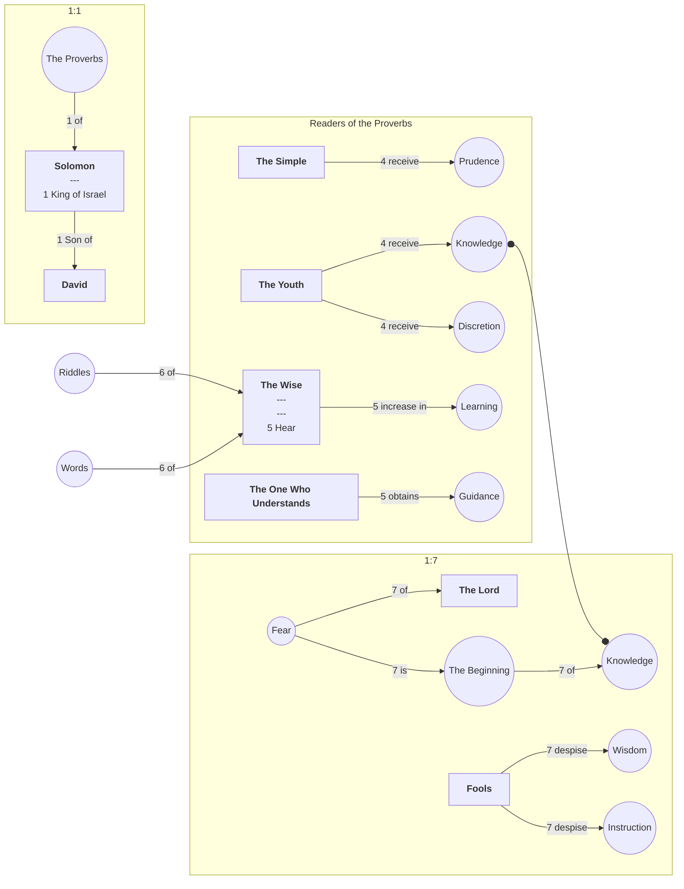

```mermaid
flowchart LR
	theProverbs((The Proverbs))
	solomon["`
		**Solomon**
		---
		1 King of Israel
	`"]
	david["`**David**`"]
	theSimple["`**The Simple**`"]
	prudence((Prudence))
	theYouth["`**The Youth**`"]
	knowledge((Knowledge))
	discretion((Discretion))
	theWise["`
		**The Wise**
		---
		---
		5 Hear
	`"]
	learning((Learning))
	theOneWhoUnderstands["`**The One Who Understands**`"]
	guidance((Guidance))
	words((Words))
	riddles((Riddles))
	fear((Fear))
	theLord["`**The Lord**`"]
	theBeginning((The Beginning))
	knowledge2((Knowledge))
	fools["`**Fools**`"]
	wisdom((Wisdom))
	instruction((Instruction))

	subgraph ch1v1 [1:1]
	theProverbs --> |1 of| solomon
	solomon --> |1 Son of| david
	end
	
	subgraph readers [Readers of the Proverbs]
	theSimple --> |4 receive| prudence
	theYouth --> |4 receive| knowledge & discretion
	theWise --> |5 increase in| learning
	theOneWhoUnderstands --> |5 obtains| guidance
	end
	
	words --> |6 of| theWise
	riddles --> |6 of| theWise
	
	subgraph ch1v7 [1:7]
	fear --> |7 of| theLord
	fear --> |7 is| theBeginning
	theBeginning --> |7 of| knowledge2
	fools --> |7 despise| wisdom & instruction
	end
	
	knowledge o--o knowledge2
```
